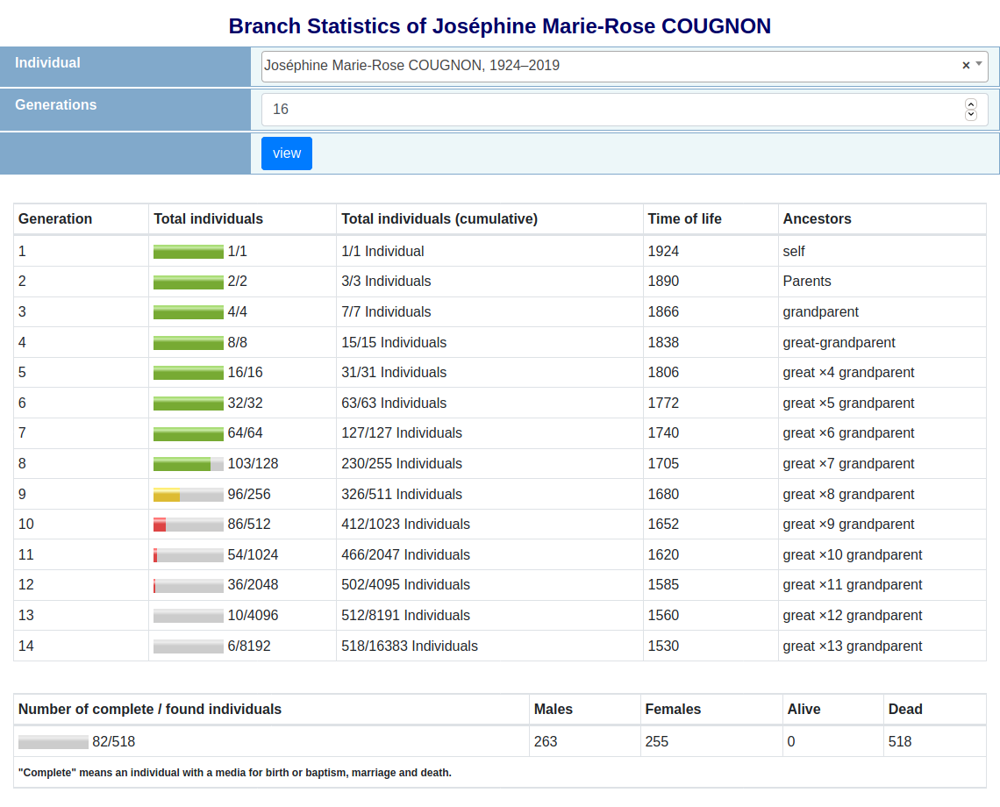
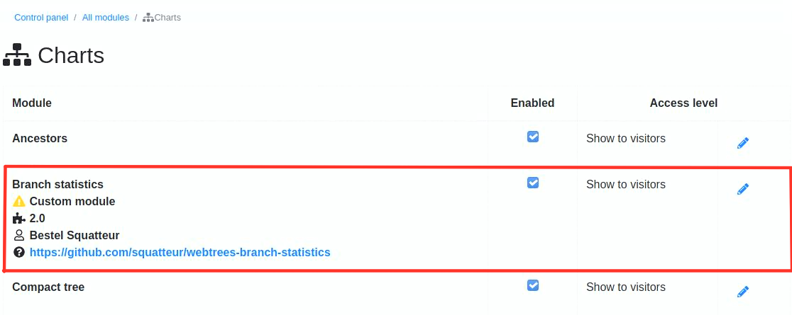

[](http://www.gnu.org/licenses/gpl-3.0)

# Branch statistics
This modules provides others statistics by generation for the [webtrees](https://www.webtrees.net) genealogy application.




## Installation
Requires webtrees 2.0.

### Using Git
If you are using ``git``, you could also clone the current master branch directly into your ``modules_v4`` directory 
by calling:

```
git clone https://github.com/squatteur/webtrees-branch_statistics.git
```

### Manual installation
To manually install the module, perform the following steps:

1. Download the [latest release](https://github.com/squatteur/webtrees-branch_statistics/releases/latest).
2. Upload the downloaded file to your web server.
3. Unzip the package into your ``modules_v4`` directory.
4. Rename the folder to ``webtrees-branch-statistics``

## Enable module
Go to the control panel (admin section) of your installation and scroll down to the ``Modules`` section. Click 
on ``Charts`` (in subsection Genealogy). Enable the ``Branch statistics`` custom module (optionally disable the original
installed fan chart module) and save your settings.




## Usage
At the charts' menu, you will find a new link called `Branch statistics`. Use the provided configuration options
to adjust according to your needs.

A ``complete individual`` indicates that he has a media for each of the following events: (BIRT or CHR) and (DEAT or BURI) and MARR
