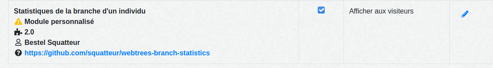

[](http://www.gnu.org/licenses/gpl-3.0)

# Statistiques de la branche d'un individu
Ce module fournit d'autres statistiques par génération pour l'application de généalogie [webtrees](https://www.webtrees.net).

*[Read this readme in english.](./README.md)*


## Installation
Nécessite webtrees 2.0.

### Utilisation de Git
Si vous utilisez ``git``, vous pouvez également cloner la branche master directement dans votre répertoire ``modules_v4`` en appelant:

```
git clone https://github.com/squatteur/webtrees-branch-statistics.git
```

### Installation manuelle
Pour installer manuellement le module, procédez comme suit:

1. Téléchargez la [dernière version](https://github.com/squatteur/webtrees-branch-statistics/releases/latest).
2. Téléversez le fichier téléchargé sur votre serveur Web.
3. Décompressez le package dans votre répertoire ``modules_v4``.
4. Renommez le dossier en ``webtrees-branch-statistics``

## Activer le module
Allez dans le panneau de contrôle (section admin) de votre installation et faites défiler jusqu'à la section ``Modules``. Cliquez sur
sur les ``Diagrammes`` (dans la sous-section Généalogie). Activez le module personnalisé ``Statistiques de branche`` et enregistrez vos paramètres. 




## Utilisation
Dans le menu des diagrammes, vous trouverez un nouveau lien appelé «Statistiques des branches». Utilisez les options de configuration fournies pour ajuster selon vos besoins.

Un ``individu complet`` indique qu'il dispose d'un média pour chacun des événements suivants: (BIRT ou CHR) et (DEAT ou BURI) et FAMS 